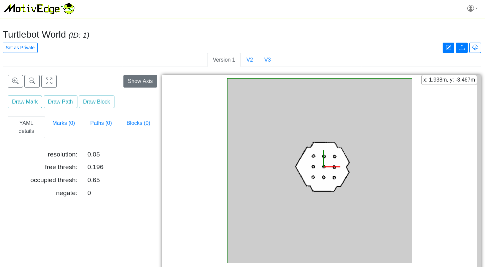
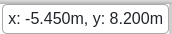
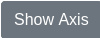
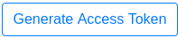

Costmap Edit & Download (2D)
============================

Below is the costmap details page. *The YAML detail will be shown on the left sidebar*:

Edit Marks / Paths / Blocks
---------------------------

.. |zoom_btns| image:: ./_static/imgs/screenshots/zoom_btns.png
.. |click_coords| image:: ./_static/imgs/screenshots/click_coords.png

We could add mark points/paths/blocks using the simple UI. After adding them,
we could get them as :code:`metadata` when downloading the map.

* Zoom in / Zoom out / Zoom reset |zoom_btns| buttons allow you to see details on the map.

* When mouse moves in the map area, the coords in real-world coordinate system will show
  on the top-right of the map |mouse_coords|

* We could also click on the map, the coords of clicked point will be shown in popup on the bottom-right
  |click_coords|

* Show / hide axis via |toggle_axis|. The red is :code:`x` axis; the green is :code:`y` axis.

Marks
"""""

* **Add** new mark point

  * Click |draw_mark| button.
  * Find your mark point position on the map when moving the mouse.
  * Left click the position and **hold & drag** to the expected direction. Then release the mouse.
  * New mark point with its angle will be added on the map.

  .. image:: ./_static/imgs/screenshots/mark_sample.png
    :align: center

* **Edit** mark points

  .. image:: ./_static/imgs/screenshots/marks.png
    :align: center

  * Click :code:`Marks` on the left sidebar to show all the marks.
  * Click |highlight| to highline the mark on the right map.
  * Update the map name on **input field**. The new name will be updated directly.
  * Click |delete| to remove the mark.

Paths
"""""

* **Add** new path

  * Click |draw_path| button.
  * Find your positions of path on the map when moving the mouse.
  * Left click the position to add path points one by one.
  * Click |right| to add the new path into the paths.
    (The |right| will enable after adding two points for the path)
  * Or click |wrong| to remove the new drawing path.

  .. image:: ./_static/imgs/screenshots/path_sample.png
    :align: center

* **Edit** paths

  .. image:: ./_static/imgs/screenshots/paths.png
    :align: center

  * Click :code:`Paths` on the left sidebar to show all the paths.
  * Click |highlight| to highline the path on the right map.
  * Update the map name on **input field**. The new name will be updated directly.
  * Click |delete| to remove the path.

Blocks
""""""

* **Add** new block

  * Click |draw_block| button.
  * Find your corner positions of block on the map when moving the mouse.
  * Left click the position to add block corners one by one.
  * Click |right| to add the new block into the blocks.
    (The |right| will enable after adding one corner for the block)
  * Or click |wrong| to remove the new block drawing.

  .. image:: ./_static/imgs/screenshots/block_sample.png
    :align: center

* **Edit** blocks

  .. image:: ./_static/imgs/screenshots/blocks.png
    :align: center

  * Click :code:`Blocks` on the left sidebar to show all the blocks.
  * Click |highlight| to highline the block on the right map.
  * Update the map name on **input field**. The new name will be updated directly.
  * Click |delete| to remove the block.

Edit Map Image
--------------

Edit the image directly on the map image. You don't need to open GIMP again.

*Currently, it's under developing. Coming soon...*

Download Map
------------

Download via site
"""""""""""""""""

* Click |download_btn| on the right side of map details page
* Save :code:`map.zip` to your PC. The :code:`map.zip` includes:

  * :code:`map.png`, the costmap
  * :code:`map.yaml`, the related YAML file of the costmap
  * :code:`metadata.yaml`, the file contains mark points / paths / blocks

API Fetch Map
"""""""""""""

1. **Use our SDK (recommended)**. For more options or details, please check `SDK <SDK.html>`_ page.

   * Click :code:`Profile & Token` link under |profile_icon| and land to :code:`Profile & Token` page.
   * Click |access_token_btn| button and get the token.
   * Install our sdk.

     .. code:: bash

        pip install git+https://github.com/motivedge/python_sdk.git

   * Find the target map's :code:`MAP_ID` in the map details page.
   * Use `download.py` script which is in our sdk :code:`scripts` folder to fetch map

     .. code:: bash

        python scripts/download.py -m <map_id> -p <target_folder> --me_token <token>

2. Use :code:`curl` and :code:`unzip` fetch map.

   * Download map via our API *(bash code)*

     .. code:: bash

        curl -v -o map.zip -X GET "http://api.motivedge.io/map/MAP_ID/2d?me_token=TOKEN"

   * :code:`MAP_ID` could be found in the map details page.
     *(Next to the map name)*
   * :code:`me_token` is the generated token using above button.
     *(Required field)*

   * The fetched map zip file includes :code:`map.yaml`, :code:`map.png` (costmap), and :code:`metadata.yaml`
     (the marks points / paths / blocks). We could unzip the file *(bash code)*:

     .. code:: bash

        unzip map.zip

Downloaded :code:`metadata.yaml` Data Struct
--------------------------------------------

After downloading above map zip file, it contains :code:`metadata.yaml` file which
contains all the mark points/paths/blocks which we edited on portal site.

When reading yaml file in programs, its data structure likes below:

.. code:: python

    {
        "marks": [ {
            "name": "docking", # mark point's name
            "x": 1.2, # x coord
            "y": 3.5, # y coord
            "rz": 3.14 # point angle to the x axis
        }, {
            "name": "table201", # mark point's name
            "x": 12.4, # x coord
            "y": 22.5, # y coord
            "rz": 1.5 # point angle to the x axis
        },
        ...], # "marks" contains a list of mark points info

        "paths": [{
            "name": "path2room1", # path's name
            "path": [
                # Contains the ordered list of path points. (x coord, y coord)
                (-1.5, 0.8), # Start point
                (-1.7, 0.5), # middle point
                (-2.3, 1.5), # middle point
                (-5.2, 2.0) # End point
            ]
        },
        ...], # "paths" contains a list of paths info

        "blocks": [{
            "name": "dangerzone", # block area's name
            "corners": [
                # Contains the list of block corner points. (x coord, y coord)
                (1.5, 2.8),
                (1.7, 2.5),
                (2.3, 3.5),
                (5.2, 4.0)
            ]
        },
        ...], # "blocks" contains a list of blocks info
    }
