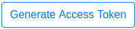

Point Cloud Map Edit & Download (3D)
====================================

Below is the Point Cloud Map details page.
We could use the mouse wheel to zoom in/out and right click&drag to move around the map.

.. image:: ./_static/imgs/screenshots/pcd_page.png
   :align: center

.. |download_btn| image:: ./_static/imgs/screenshots/download_btn.png

Edit
----

Coming soon...

Download Costmap
----------------

Our algorithm will generate 2D costmap automatically. The costmap is 100% compatable with robots.

Download via site
"""""""""""""""""

* Click |download_btn| on the right side of map details page
* Input the lider height to the ground and resolution of the costmap

  .. image:: ./_static/imgs/screenshots/3d_download_input.png
     :align: center

* Click :code:`OK` to download the :code:`map.zip` to your PC. The :code:`map.zip` includes:

  * :code:`map.png`, the costmap
  * :code:`map.yaml`, the related YAML file of the costmap

API Fetch Map
"""""""""""""

1. **Use our SDK (recommended)**. For more options or details, please check `SDK <SDK.html>`_ page.

   * Click :code:`Profile & Token` link under |profile_icon| and land to :code:`Profile & Token` page.
   * Click |access_token_btn| button and get the token.
   * Install our sdk.

     .. code:: bash

        pip install git+https://github.com/motivedge/python_sdk.git

   * Find the target map's :code:`MAP_ID` in the map details page.
   * Use `download.py` script which is in our sdk :code:`scripts` folder to fetch map

     .. code:: bash

        python scripts/download.py -m <map_id> -p <target_folder> --lidar_height <float_value> --resolution <float_value> --me_token <token>

2. Use :code:`curl` and :code:`unzip` fetch map.

   * Click :code:`Profile & Token` link under |profile_icon| and land to :code:`Profile & Token` page.
   * Click |access_token_btn| button and get the token.
   * Download map via our API *(bash code)*

     .. code:: bash

        curl -v -o map.zip -X GET "http://api.motivedge.io/map/MAP_ID/2d?h=0.5&r=0.05&me_token=TOKEN"

     * :code:`MAP_ID` could be found in the map details page.
       *(Next to the map name)*
     * :code:`me_token` is the generated token using above button.
       *(Required field)*
     * :code:`h` means the lidar height to the ground.
       *(Required field)*
     * :code:`r` means the 2D map resolution for each pixel. Default value is 0.05.
       *(Optional field)*

   * The fetched map zip file includes :code:`map.yaml` and :code:`map.png` (costmap).
     We could unzip the file *(bash code)*:

     .. code:: bash

        unzip map.zip
