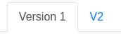

Generate Map Management
=======================

Upload 2D/3D Maps
-----------------

.. |create_map| image:: ./_static/imgs/screenshots/create_map.png
.. |create_build_link| image:: ./_static/imgs/screenshots/create_build_link.png
.. |display_btns| image:: ./_static/imgs/screenshots/display_btns.png

1. Register an account on `our portal site <https://portal.motivedge.io/>`_

2. Click |create_map| button on the left side of home page.

.. margin:: Link

   Below of building selector, you could find:
   |create_build_link|

3. Upload your 2D or 3D map on the uploading map page.

   3.1. If there is no building which you are looking for, create a new one. :)

4. After uploading, you will see your maps at home page.

.. note:: **Show maps in different ways**

    Toggle or select different display styles. The :code:`Group Show` will display all
    version of a map in a row.
    |display_btns|

Private / Public Maps
---------------------

Currently, we only support :code:`private` and :code:`public`, two modes.

* :code:`private` maps could only be viewed and edited by your-selves.
* :code:`public` maps could be viewed by all users on our site. All users could
  add their own mark points/paths/blocks.

.. note:: **More than 2 modes - More Permission Control**

    *The Google Doc liked map sharing permission control is under developing.*

    After deploying the new version, you could share the specific maps to others
    with :code:`view` / :code:`edit` permissions.

.. tip:: Toggle :code:`private` / :code:`public`

    1. Click into the map details page at home page.
    2. Click |private_toggle| toggle button on the left side of the map details page
       to set map as :code:`private` or :code:`public`.

Map Version Control
-------------------

We support different versions for the same map. There are two ways to upload
new versions.

1. Go the map details page, and click upload button on the right side |upload_btn|.
   You only need to upload new map costmap or point cloud. *(recommended)*
2. |create_map| - Create the new map with same name and same building. Our system
   will make the new map as new version automatically.

After uploading several versions for a same map, you could see the version links
|versions| at top of map details page. Clicking each one to view details.
