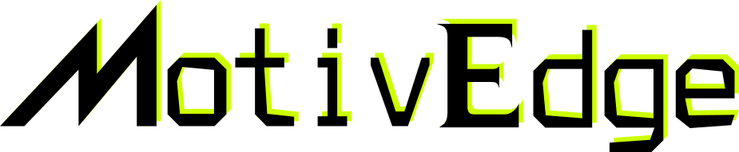

.. Building high-definition maps for indoor venues and managing maps in portal

.. compound::
   :class: headline_title

   Building high-definition maps for indoor venues and managing maps in portal

.. compound:: Features
   :class: feature_list

   * Manage 2D costmap and 3D point cloud map in our central place
   * Version control for each map
   * Edit map directly on the site and save automatically
   * Add/update stopping positions, paths and blocking areas online as metadata of the map
   * Download map and metadata via our API in seconds
   * Generate 2D costmap from 3D point cloud map autmatically
   * Access public maps
   * Share maps among team members with different permissons (coming soon)
   * SDK package to integrate our service easily (coming soon)
   * ROS1 & ROS2 intergration package (coming soon)

Portal @MotivEdge.io
====================

.. toctree::
   :maxdepth: 2

   general_manage
   2dmap
   3dmap
   SDK

.. Remove below parts. Not necessary here TODO

Indices and tables
==================

* :ref:`genindex`
* :ref:`modindex`
* :ref:`search`
